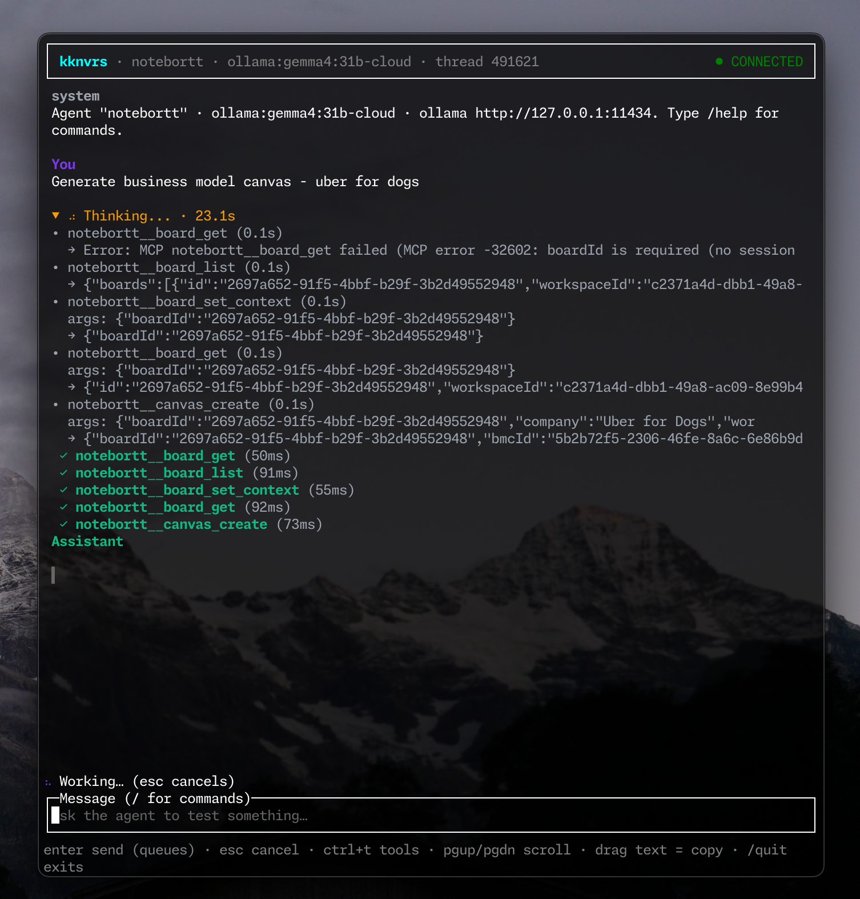

# kknvrs

Universal tiny OpenTUI tester for your web MCPs / SaaS apps with ReAct loop without unnecessary context from claude-code / opencode.



```bash
npm install
kknvrs init                        # writes ./kknvrs.json example config
kknvrs                             # TUI: npm run dev (Node 26+ for node:ffi)
npm run build && npm start
```

| Flag | Env | Default |
| ---- | --- | ------- |
| `--config` | `KKNVRS_CONFIG` | `./kknvrs.json`, then `$KKNVRS_HOME/kknvrs.json` (default `~/.config/kknvrs/kknvrs.json`) |
| `--agent` | `KKNVRS_AGENT` | config `defaultAgent` |
| `--provider` | `KKNVRS_PROVIDER` | agent default (`ollama`) |
| `--model` | `KKNVRS_MODEL` | agent default |
| `--ollama-url` | `KKNVRS_OLLAMA_URL` | `http://127.0.0.1:11434` |
| `--thread` | `KKNVRS_THREAD` | most recent |

## Config (`kknvrs.json`, opencode-style)

```jsonc
{
    "mcp": {
        "notebortt-local": { "type": "remote", "url": "http://localhost:8080/mcp", "oauth": {} },
        "todoist-ai": {
            "type": "remote",
            "url": "http://localhost:8000/mcp/",
            "oauth": false,
            "headers": { "Authorization": "Bearer {env:TODOIST_AI_TOKEN}" }
        }
    },
    "agent": {
        // Optional: per-field overrides for agents/*.md files.
        // Prefer agents/notebortt-explorer.md for the system prompt;
        // inline systemPrompt here wins over the file if set.
        "notebortt-explorer": {
            "provider": "ollama",
            "model": "gemma4:31b-cloud",
            "mcps": ["notebortt-local"]
        },
        "notebortt-adversarial": { "...": "second agent, same website" }
    },
    "defaultAgent": "notebortt-explorer",
    "provider": { "ollama": { "baseURL": "http://127.0.0.1:11434" } }
}
```

- **MCPs**: `remote` (Streamable HTTP) with `oauth: {}` (MCP OAuth 2.1/DCR —
  like `opencode mcp auth`) or `oauth: false` + static `headers` (supports
  `{env:VAR}`); `local` (stdio `command` + `env`). `enabled: false` skips.
- **Agents**: multiple agents per website, each with its own `mcps`,
  `model`, `maxSteps`. Prompts live in markdown files, not JSON:
  `<config-dir>/agents/*.md` (i.e. `agents/` next to your `kknvrs.json`)
  plus `$KKNVRS_HOME/agents/*.md` (default `~/.config/kknvrs/agents/*.md`).
  File name = agent name; `<config-dir>/agents/` wins on name clash.
  Frontmatter sets the knobs, the body is the system prompt — same shape
  as opencode agents:
  ```md
  ---
  description: Notebortt board assistant.
  provider: ollama
  model: gemma4:31b-cloud
  mcps: [notebortt-local]
  maxSteps: 25
  ---
  You are the Notebortt board assistant. ...
  ```
  Only `provider`, `model`, `mcps` (array or comma-separated string),
  `maxSteps` are read from frontmatter — other keys (`description`,
  `mode`, `permission`, ...) are currently ignored. Inline `agent`
  entries in `kknvrs.json` still work and win per-field over the file
  (so JSON can override `model` while the file owns the prompt).
- **Providers**: `ollama` first (native `/api/chat` tool calling).

## Creating agents

```bash
mkdir -p ./agents                # per-project, next to kknvrs.json (wins on name clash)
mkdir -p ~/.config/kknvrs/agents # global fallback ($KKNVRS_HOME/agents)
```

1. Create `<name>.md` — the file name (minus `.md`) is the agent name,
   e.g. `agents/notebortt-explorer.md`.
2. Optional YAML frontmatter sets the knobs: `provider` (default `ollama`),
   `model` (default `gemma4:31b-cloud`), `mcps` (array or comma-separated
   string; default: all enabled servers), `maxSteps` (default `25`). Other
   keys (`description`, `mode`, ...) are currently ignored.
3. The body is the system prompt. No frontmatter = whole file is the prompt.
4. Point `defaultAgent` in `kknvrs.json` at it, or pick it with
   `--agent <name>` / `/agent <name>` in-app.
5. Verify with `/agents` in-app.

Inline `agent` entries in `kknvrs.json` merge over the file per-field, so
JSON can override `model` while the file owns the prompt.

## MCP auth (OAuth, like `opencode mcp auth`)

```bash
kknvrs mcp auth <name>     # discover → register → browser → save $KKNVRS_HOME/mcp-auth/<name>.json (default ~/.config/kknvrs/mcp-auth/)
kknvrs mcp logout <name>   # drop saved tokens
```

Same flow in-app: `/mcp auth <name>` prints the shell command.
Tokens refresh automatically when the server issued a refresh token.

## In-app slash commands

`/agents` · `/agent [name]` · `/clear` (local `$KKNVRS_HOME/threads/`) ·
`/thread [id]` · `/threads` · `/sessions` · `/provider` · `/model` ·
`/mcp status` · `/tools` (aggregated `<server>__<tool>`) ·
`/resources [server]` · `/prompts [server]` ·
`/call <server.tool> <json>` (bypass the LLM) · `/read <server> <uri>` · `/quit`

Plain text always goes to the active agent's ReAct loop; `/call` is the
direct-mode equivalent. Full key list: `/help` in-app.
